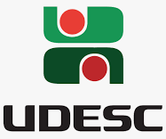
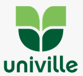
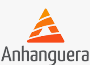
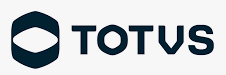
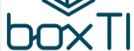
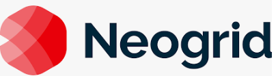
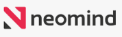
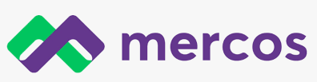

  <h1 style="font-size: 4.5rem; color: #1a5276; text-align: center; margin: 0; line-height: 1.2;">
    Cursos de Computação e Informática
  </h1>

  <h2 style="font-size: 3rem; color: #2874a6; text-align: center; margin: 0;">
    Em Joinville e Araquari
  </h2>

  

    Oportunidades de formação para o 3º ano do Ensino Médio
  

---

---

  
  <h2 style="background: #1a5276; color: #fff; padding: 10px 20px; border-radius: 10px; margin: 0;">
    Sistemas de Informação (BSI)
  </h2>

  
    Bacharelado
  
  
    ☀️ Matutino
  
  
    ⏳ 4 anos
  

Análise de sistemas, programação, bancos de dados, redes, gestão de TI e desenvolvimento de soluções empresariais.

---

  
  <h2 style="background: #1a5276; color: #fff; padding: 10px 20px; border-radius: 10px; margin: 0;">
    Redes de Computadores
  </h2>

  
    Tecnólogo
  
  
    🌙 Noturno
  
  
    ⏳ 3 anos
  

Projeto, implantação e gestão de redes, telecomunicações, infraestrutura e segurança de redes.

---

  
  <h2 style="background: #1a5276; color: #fff; padding: 10px 20px; border-radius: 10px; margin: 0;">
    Ciência da Computação (BCC)
  </h2>

  
    Bacharelado
  
  
    ⏰ Integral
  
  
    ⏳ ~4,5 anos
  

  Formação em fundamentos de computação, algoritmos, estruturas de dados, programação, engenharia de software e pesquisa científica em computação.

---

  
  <h2 style="background: #1a5276; color: #fff; padding: 10px 20px; border-radius: 10px; margin: 0;">
    Análise e Desenvolvimento de Sistemas (TADS)
  </h2>

  
    Tecnólogo
  
  
    🌙 Noturno
  
  
    ⏳ 3 anos
  

Formação prática em desenvolvimento de sistemas, programação, bancos de dados, análise de requisitos e gestão de projetos de software.

---

  
  <h2 style="background: #1a5276; color: #fff; padding: 10px 20px; border-radius: 10px; margin: 0;">
    Sistemas de Informação (BSI)
  </h2>

  
    🎓 Bacharelado
  
  
    ☀️ Matutino / 🌙 Noturno
  
  
    ⏳ 4 anos
  

Desenvolvimento profissional em análise de sistemas, programação orientada a objetos, bancos de dados, redes e inteligência artificial.

---

  
  <h2 style="background: #1a5276; color: #fff; padding: 10px 20px; border-radius: 10px; margin: 0;">
    Engenharia de Software (BES)
  </h2>

  
    🎓 Bacharelado
  
  
    ☀️ Matutino / 🌙 Noturno
  
  
    ⏳ 4 anos
  

Especialização em desenvolvimento de software, banco de dados, redes, gestão de projetos e processos de software.

---

  
  <h2 style="background: #1a5276; color: #fff; padding: 10px 20px; border-radius: 10px; margin: 0;">
    Engenharia de Software (BES)
  </h2>

  
    🎓 Bacharelado
  
  
    ☀️ Matutino / 🌙 Noturno
  
  
    ⏳ 4 anos
  

  Processos de desenvolvimento, qualidade de software, gestão de projetos e arquitetura de sistemas.

---

  
  <h2 style="background: #1a5276; color: #fff; padding: 10px 20px; border-radius: 10px; margin: 0;">
    Ciência da Computação (BCC)
  </h2>

  
    🎓 Bacharelado
  
  
    🌙 Noturno
  
  
    ⏳ 4 anos
  

  Formação abrangente em computação teórica, algoritmos, desenvolvimento de software e pesquisa em IA.

---

  
  <h2 style="background: #1a5276; color: #fff; padding: 10px 20px; border-radius: 10px; margin: 0;">
    Engenharia da Computação (EGC)
  </h2>

  
    🎓 Bacharelado
  
  
    🌙 Noturno
  
  
    ⏳ 4 anos
  

  Desenvolvimento em hardware, sistemas embarcados, eletrônica digital, arquitetura de computadores e IoT.

---

  
  <h2 style="background: #1a5276; color: #fff; padding: 10px 20px; border-radius: 10px; margin: 0;">
  Análise e Desenvolvimento de Sistemas (TADS)
  </h2>

  
    🎓 Tecnólogo
  
  
    🌙 Noturno
  
  
    ⏳ 3 anos
  

  Desenvolvimento prático de sistemas, linguagens de programação, bancos de dados e soluções corporativas.

---

  <h1 style="font-size: 4.5rem; color: #1a5276; text-align: center; margin: 0; line-height: 1.2;">
    Maiores Empresas de TI na Região
  </h1>

  

    Oportunidades de trabalho após a formação
  

---

---

  

  

    Gestão Empresarial e Compliance
  

  

    Software para gestão integrada de conformidade, inovação e transformação digital.
  

  

    Tecnologias: Java, JavaScript, Cloud Computing, BPM, ECM, GRC, APIs REST, Docker, Kubernetes
  

---

  

  

    Sistemas de Gestão Empresarial (ERP)
  

  

    Maior empresa de tecnologia do Brasil, líder em ERPs e sistemas de gestão empresarial.
  

  

    Tecnologias: Java, .NET, ADVPL, Angular, Cloud Computing, Microserviços, SQL Server, PostgreSQL
  

---

  

  

    Infraestrutura de TI e Cibersegurança
  

  

    Soluções em infraestrutura, cibersegurança, cloud e serviços gerenciados de TI.
  

  

    Tecnologias: Microsoft Azure, Citrix, Kaspersky, Veeam, ManageEngine, VMware, Fortinet, Linux
  

---

  

  

    Desenvolvimento de Software Sob Medida
  

  

    Soluções digitais personalizadas, integração de sistemas, portais corporativos e aplicativos para otimizar processos e conectar empresas.
  

  

    Tecnologias: .NET, Node.js, Angular, React, Flutter, SQL Server, Azure, AWS, Metodologias Ágeis
  

---

  

  

    Simplificação e Automação Tributária
  

  

   Busca revolucionar a forma como empresas brasileiras apuram, declaram e pagam impostos por meio de tecnologia, automação e inteligência artificial, reduzindo custos e complexidade da conformidade fiscal.
  

  

    Tecnologias: React, Python, Django, Machine Learning, APIs REST, Cloud Computing, Docker, Kubernetes
  

---

  

  

    Fintech e Pagamentos
  

  

    Plataforma de gestão financeira e cobranças para PMEs, com conta digital PJ completa.
  

  

    Tecnologias: Java, Kotlin, Spring Boot, Angular, APIs REST, Microserviços, Cloud, Fintech Stack
  

---

  

  

    Fintech e Gestão Financeira
  

  

    ERP em nuvem para gestão financeira de PMEs, automatizando processos administrativos e contábeis.
  

  

    Tecnologias: Cloud Computing, SaaS, Python, JavaScript, Microserviços, APIs REST, Inteligência Artificial
  

---

  

  

    Supply Chain e Varejo
  

  

    Ecossistema de tecnologia para gestão automática de supply chain, conectando indústria e varejo.
  

  

    Tecnologias: Big Data, Inteligência Artificial, EDI, Machine Learning, Cloud Computing, APIs, Analytics
  

---

  

  

    Gestão Logística e Gerenciamento de Risco
  

  

    Soluções tecnológicas para gerenciamento de risco e gestão logística em transportes.
  

  

    Tecnologias: IoT, Rastreamento GPS, Big Data, Cloud Computing, APIs, Telemetria, Mobile
  

---

  

  

    Outsourcing de TI e Soluções Tecnológicas
  

  

    Maior One-Stop-Tech do Brasil, oferecendo outsourcing, impressão, automação e infraestrutura.
  

  

    Tecnologias: Cloud Computing, Infraestrutura de TI, Segurança da Informação, Automação, ECM, RPA
  

---

  

  

    Compliance Fiscal, Tributário e Aduaneiro
  

  

    Tecnologia e consultoria para gestão fiscal, tributária e aduaneira em cadeias produtivas.
  

  

    Tecnologias: Machine Learning, Data Science, Inteligência Artificial, Big Data, Cloud, APIs, Java
  

---

  

  

    Help Desk e Service Desk
  

  

    Plataforma de atendimento a clientes, gestão de tickets, chamados e contratos recorrentes.
  

  

    Tecnologias: Cloud Computing, SaaS, APIs, Integração WhatsApp, Webhooks, JavaScript, PostgreSQL
  

---

  

  

    Cibersegurança
  

  

    Soluções de cibersegurança e pentests para proteção contra ataques cibernéticos.
  

  

    Tecnologias: Pentest, Segurança da Informação, Ethical Hacking, Vulnerability Assessment, SOC
  

---

  

  

    ERP
  

  

    Seu principal produto é o SysTeam ERP, um dos ERPs mais completos e integrados do mercado, premiado por sua modernidade.
  

  

    Tecnologias: ERP, Business Intelligence, WMS (Warehouse Management System), Integração com APIs, JavaScript, PostgreSQL
  

---

  

  

    Gestão de Processos e Documentos (BPM/ECM)
  

  

    Plataforma de gestão de processos, documentos, indicadores e transformação digital.
  

  

    Tecnologias: BPM, ECM, Low-Code/No-Code, RPA, Workflow, BPMN, Assinatura Digital, Cloud, APIs
  

---

  

  

    Soluções Tecnológicas para Gestão Empresarial e Otimização de Processos
  

  

    Soluções tecnológicas para gestão empresarial e otimização de processos.
  

  

    Tecnologias: ERP, automação, integração
  

---

  

  

    Consultoria e Serviços de Tecnologia da Informação
  

  

   Licenciamento de software, venda de hardware, monitoramento, suporte, consultoria e projetos personalizados.
  

  

    Tecnologias: Gerenciamento e sustentação de ambientes, licenciamento de software, Cloud Computing, Infraestrutura, Segurança da Informação, Consultoria, Projetos TI
  

---

  

  

    Tecnologia para o Varejo
  

  

    Software de gestão para o varejo na América Latina. Soluções integradas em ERP, PDV, digital, autoatendimento, delivery, entre outros.
  

  

    Tecnologias: ERP, PDV, Cloud Services, E-commerce, Mobilidade, CRM, TEF, RFID, NFC-e e SAT, Integração Omnichannel
  

---

  

  

    Sistema de Vendas e E-commerce B2B para Distribuidoras e Representantes
  

  

   Solução completa para automatizar a operação comercial com IA, CRM, emissão de pedidos, gestão de estoque, e-commerce integrado, e integração com qualquer ERP.
  

  

    Tecnologias: Inteligência Artificial, CRM, ERP Integrado, E-commerce B2B, Automação de Pedidos
  

---

  

  

    Transformação Digital para o Setor Público
  

  

    Processos digitais no setor público, oferecendo soluções inteligentes e integradas para justiça, infraestrutura, obras e processos administrativos, focando em agilidade, transparência e eficiência.
  

  

    Tecnologias: SaaS, IA, Processos Digitais, Compliance, Infraestrutura, Gestão Pública, Software em Nuvem
  

---

  

  

    Plataforma Integrada de Saúde, Segurança e Meio Ambiente (EHS/SST)
  

  

    Solução com IA nativa para automatizar a gestão de saúde, segurança, meio ambiente e compliance regulatório.
  

  

    Tecnologias: SaaS, IA, EHS e ESG, compliance documental, análise preditiva, integração com sistemas de RH
  

---

  

  

    Plataforma de Agenciamento de Motoristas Profissionais de Caminhão
  

  

    Conecta caminhoneiros autônomos e ajudantes a transportadoras para serviços de transporte de cargas pontuais.
  

  

    Tecnologias: agenciamento, CRM, verificação documental, mapeamento de riscos por satélite, automação de contratos e pagamentos.
  

---

  

  

    Sistemas de Gestão Empresarial ERP para Indústrias, Distribuidoras e Redes de Lojas
  

  

    ERP integrado e uma plataforma complementar de business intelligence (nexBI) para suporte à decisão.
  

  

    Tecnologias: ERP, BI, Cloud Computing, Automação de Processos, Compliance Fiscal, Integração de Sistemas
  

---

  

  

    Plataforma de Gerenciamento de Vagas para Profissionais de Saúde
  

  

    Conecta profissionais de enfermagem e saúde a oportunidades de trabalho em grandes redes hospitalares nos Estados Unidos, permitindo gerenciar vagas, candidaturas, histórico de turnos e pagamentos.
  

  

    Tecnologias: API Rest, Ruby on Rails
  

---

  

    Próximos Passos
  

  

    ✅ Visite os sites das instituições 
    ✅ Conheça as empresas da região 
    ✅ Participe de eventos e palestras 
    ✅ Faça escolhas alinhadas com seus interesses 
    ✅ Inicie sua carreira em TI!
  

