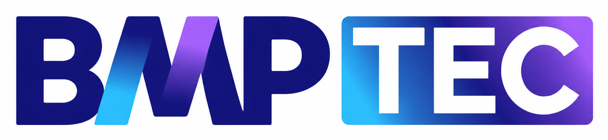

<!-- _class: lead -->

  <h1 style="font-size: 4.5rem; color: #1a5276; text-align: center; margin: 0; line-height: 1.2;">
    Cursos de Computação e Informática
  </h1>

  <h2 style="font-size: 3rem; color: #2874a6; text-align: center; margin: 0;">
    Em Joinville e Araquari
  </h2>

  

    Oportunidades de formação para o 3º ano do Ensino Médio
  

---
<!-- _class: lead -->

---

  
  <h2>
    Sistemas de Informação (BSI)
  </h2>

  
    🎓 Bacharelado
  
  
    ☀️ Matutino
  
  
    ⏳ 4 anos
  

Curso público e gratuito em campus federal. Forma profissionais em análise de sistemas, programação, bancos de dados e redes, com ênfase em pesquisa e desenvolvimento de soluções empresariais.

---

  
  <h2>
    Redes de Computadores
  </h2>

  
    🎓 Tecnólogo
  
  
    🌙 Noturno
  
  
    ⏳ 3 anos
  

Curso público e gratuito em campus federal. Forma profissionais em projeto, implantação e gestão de redes, telecomunicações e segurança — base para certificações como CCNA e CompTIA Network+.

---

  
  <h2>
    Ciência da Computação (BCC)
  </h2>

  
    🎓 Bacharelado
  
  
    ⏰ Integral
  
  
    ⏳ ~4,5 anos
  

  Curso público e gratuito com forte base científica. Forma pesquisadores e engenheiros em algoritmos, estruturas de dados, inteligência artificial, engenharia de software e computação de alto desempenho.

---

  
  <h2>
    Análise e Desenvolvimento de Sistemas (TADS)
  </h2>

  
    🎓 Tecnólogo
  
  
    🌙 Noturno
  
  
    ⏳ 3 anos
  

Curso público e gratuito com foco em desenvolvimento ágil. Forma desenvolvedores full-stack em programação, bancos de dados, DevOps, análise de requisitos e gestão de projetos de software.

---

  
  <h2>
    Sistemas de Informação (BSI)
  </h2>

  
    🎓 Bacharelado
  
  
    ☀️ Matutino / 🌙 Noturno
  
  
    ⏳ 4 anos
  

Formação voltada ao mercado corporativo com ênfase em programação orientada a objetos, arquitetura de sistemas, inteligência artificial e integração com o ecossistema empresarial regional.

---

  
  <h2>
    Engenharia de Software (BES)
  </h2>

  
    🎓 Bacharelado
  
  
    ☀️ Matutino / 🌙 Noturno
  
  
    ⏳ 4 anos
  

Foco em engenharia de processos, qualidade de software, DevOps, metodologias ágeis e arquitetura de sistemas — preparando engenheiros para os desafios de grandes projetos de software.

---

  
  <h2>
    Engenharia de Software (BES)
  </h2>

  
    🎓 Bacharelado
  
  
    ☀️ Matutino / 🌙 Noturno
  
  
    ⏳ 4 anos
  

  Formação em engenharia de software com ênfase em qualidade, arquitetura de sistemas, métodos ágeis e gestão de projetos — preparando profissionais para liderar equipes de desenvolvimento.

---

  
  <h2>
    Ciência da Computação (BCC)
  </h2>

  
    🎓 Bacharelado
  
  
    🌙 Noturno
  
  
    ⏳ 4 anos
  

  Formação abrangente cobrindo computação teórica, algoritmos, estruturas de dados, desenvolvimento de software e fundamentos de IA — com aulas noturnas para quem já trabalha.

---

  
  <h2>
    Engenharia da Computação (EGC)
  </h2>

  
    🎓 Bacharelado
  
  
    🌙 Noturno
  
  
    ⏳ 4 anos
  

  Integra eletrônica, programação e gestão de projetos. Forma engenheiros para hardware, sistemas embarcados, IoT, robótica e automação industrial — um dos perfis mais demandados pelo setor industrial.

---

  
  <h2>
  Análise e Desenvolvimento de Sistemas (TADS)
  </h2>

  
    🎓 Tecnólogo
  
  
    🌙 Noturno
  
  
    ⏳ 3 anos
  

  Tecnólogo com entrada rápida no mercado. Forma desenvolvedores em programação, bancos de dados e soluções corporativas, com duração de apenas 3 anos e aulas noturnas.

---
<!-- _class: lead -->

  <h1 style="font-size: 4.5rem; color: #1a5276; text-align: center; margin: 0; line-height: 1.2;">
    Maiores Empresas de TI na Região
  </h1>

  

    27 empresas com oportunidades de trabalho após a formação
  

---
<!-- _class: lead -->

---

  

  

    🏆 Gestão Empresarial e Compliance
  

  

    Software para gestão integrada de conformidade, inovação e transformação digital.
  

  

    Tecnologias: Java, JavaScript, Cloud Computing, BPM, ECM, GRC, APIs REST, Docker, Kubernetes
  

---

  

  

    📊 Sistemas de Gestão Empresarial (ERP)
  

  

    Maior empresa de tecnologia do Brasil, líder em ERPs e sistemas de gestão empresarial.
  

  

    Tecnologias: ADVPL, TLPP, Angular, TypeScript
  

---

  

  

    🖥️ Infraestrutura de TI e Cibersegurança
  

  

    Soluções em infraestrutura, cibersegurança, cloud e serviços gerenciados de TI.
  

  

    Tecnologias: Microsoft Azure, Citrix, Kaspersky, Veeam, ManageEngine, VMware, Fortinet, Linux
  

---

  

  

    💻 Desenvolvimento de Software Sob Medida
  

  

    Soluções digitais personalizadas, integração de sistemas, portais corporativos e aplicativos para otimizar processos e conectar empresas.
  

  

    Tecnologias: .NET, Node.js, Angular, React, Flutter, SQL Server, Azure, AWS, Metodologias Ágeis
  

---

  

  

    🧾 Simplificação e Automação Tributária
  

  

   Plataforma de automação tributária com IA para simplificar apuração, declaração e pagamento de impostos — reduzindo custos e complexidade do compliance fiscal brasileiro.
  

  

    Tecnologias: React, Python, Django, Machine Learning, APIs REST, Cloud Computing, Docker, Kubernetes
  

---

  

  

    💳 Fintech e Pagamentos
  

  

    Plataforma de gestão financeira e cobranças para PMEs, com conta digital PJ completa.
  

  

    Tecnologias: Java, Kotlin, Spring Boot, Angular, TypeScript, APIs REST, Microservices, AWS, PostgreSQL
  

---

  

  

    💰 Fintech e Gestão Financeira
  

  

    ERP em nuvem para gestão financeira de PMEs, automatizando processos administrativos e contábeis.
  

  

    Tecnologias: Cloud Computing, SaaS, Python, JavaScript, Microserviços, APIs REST, Inteligência Artificial
  

---

  

  

    📦 Supply Chain e Varejo
  

  

    Ecossistema de tecnologia para gestão automática de supply chain, conectando indústria e varejo.
  

  

    Tecnologias: Big Data, Inteligência Artificial, EDI, Machine Learning, Cloud Computing, APIs, Analytics
  

---

  

  

    🚚 Gestão Logística e Gerenciamento de Risco
  

  

    Soluções tecnológicas para gerenciamento de risco e gestão logística em transportes.
  

  

    Tecnologias: IoT, Rastreamento GPS, Big Data, Cloud Computing, APIs, Telemetria, Mobile
  

---

  

  

    🖨️ Outsourcing de TI e Soluções Tecnológicas
  

  

    Maior One-Stop-Tech do Brasil, oferecendo outsourcing, impressão, automação e infraestrutura.
  

  

    Tecnologias: Cloud Computing, Infraestrutura de TI, Segurança da Informação, Automação, ECM, RPA
  

---

  

  

    ⚖️ Compliance Fiscal, Tributário e Aduaneiro
  

  

    Tecnologia e consultoria para gestão fiscal, tributária e aduaneira em cadeias produtivas.
  

  

    Tecnologias: Machine Learning, Data Science, Inteligência Artificial, Big Data, Cloud, APIs, Java
  

---

  

  

    🎫 Help Desk e Service Desk
  

  

    Plataforma de atendimento a clientes, gestão de tickets, chamados e contratos recorrentes.
  

  

    Tecnologias: Cloud Computing, SaaS, APIs, Integração WhatsApp, Webhooks, JavaScript, PostgreSQL
  

---

  

  

    🔒 Cibersegurança
  

  

    Especializada em cibersegurança ofensiva e defensiva: pentests, análise de vulnerabilidades, SOC gerenciado e treinamentos em segurança para equipes técnicas.
  

  

    Tecnologias: Pentest, Segurança da Informação, Ethical Hacking, Vulnerability Assessment, SOC
  

---

  

  

    🏗️ ERP para Indústria e Comércio — SysTeam
  

  

    ERP completo e integrado para indústrias e comércio, com módulos de produção, estoque (WMS), financeiro e business intelligence. Seu principal produto, o SysTeam ERP, é premiado pela modernidade e integração.
  

  

    Tecnologias: ERP, Business Intelligence, WMS (Warehouse Management System), Integração com APIs, JavaScript, PostgreSQL
  

---

  

  

    🔄 Gestão de Processos e Documentos (BPM/ECM)
  

  

    Plataforma de gestão de processos, documentos, indicadores e transformação digital.
  

  

    Tecnologias: BPM, ECM, Low-Code/No-Code, RPA, Workflow, BPMN, Assinatura Digital, Cloud, APIs
  

---

  

  

    🏭 ERP e Gestão para Indústrias e Distribuidoras
  

  

    ERP e soluções de gestão para indústrias e distribuidoras, com módulos integrados de produção, fiscal, financeiro e CRM.
  

  

    Tecnologias: Delphi, .NET, SQL Server, SPED/NF-e, Integração com APIs, Automação de Processos
  

---

  

  

    🛠️ Consultoria e Serviços de TI
  

  

   Licenciamento de software, venda de hardware, monitoramento, suporte, consultoria e projetos personalizados.
  

  

    Tecnologias: Cloud Computing, Infraestrutura de TI, Segurança da Informação, Licenciamento Microsoft/Adobe, Monitoramento e Suporte
  

---

  

  

    🛒 Tecnologia para o Varejo
  

  

    Software de gestão para o varejo na América Latina. Soluções integradas em ERP, PDV, digital, autoatendimento, delivery, entre outros.
  

  

    Tecnologias: ERP, PDV, Cloud Services, E-commerce, Mobilidade, CRM, TEF, RFID, NFC-e e SAT, Integração Omnichannel
  

---

  

  

    🤝 Vendas B2B e E-commerce para Distribuidoras
  

  

   Solução completa para automatizar a operação comercial com IA, CRM, emissão de pedidos, gestão de estoque, e-commerce integrado, e integração com qualquer ERP.
  

  

    Tecnologias: Inteligência Artificial, CRM, ERP Integrado, E-commerce B2B, Automação de Pedidos
  

---

  

  

    🏛️ Transformação Digital para o Setor Público
  

  

    Processos digitais no setor público, oferecendo soluções inteligentes e integradas para justiça, infraestrutura, obras e processos administrativos, focando em agilidade, transparência e eficiência.
  

  

    Tecnologias: SaaS, IA, Processos Digitais, Compliance, Infraestrutura, Gestão Pública, Software em Nuvem
  

---

  

  

    🏥 Saúde, Segurança e Meio Ambiente (EHS/SST)
  

  

    Solução com IA nativa para automatizar a gestão de saúde, segurança, meio ambiente e compliance regulatório.
  

  

    Tecnologias: SaaS, IA, EHS e ESG, compliance documental, análise preditiva, integração com sistemas de RH
  

---

  

  

    🚛 Agenciamento de Motoristas Profissionais
  

  

    Conecta caminhoneiros autônomos e ajudantes a transportadoras para serviços de transporte de cargas pontuais.
  

  

    Tecnologias: Node.js, React Native, APIs REST, Geolocalização GPS, OCR, AWS, Automação de Contratos e Pagamentos
  

---

  

  

    📋 ERP para Indústrias, Distribuidoras e Redes de Lojas
  

  

    ERP integrado e uma plataforma complementar de business intelligence (nexBI) para suporte à decisão.
  

  

    Tecnologias: ERP, BI, Cloud Computing, Automação de Processos, Compliance Fiscal, Integração de Sistemas
  

---

  

  

    👩‍⚕️ Gerenciamento de Vagas para Profissionais de Saúde
  

  

    Conecta profissionais de enfermagem e saúde a oportunidades de trabalho em grandes redes hospitalares nos Estados Unidos, permitindo gerenciar vagas, candidaturas, histórico de turnos e pagamentos.
  

  

    Tecnologias: Ruby on Rails, APIs REST, PostgreSQL, React Native, AWS, Integrações hospitalares
  

---

  

  

    🏦 Fintech — BaaS e CaaS
  

  

    Parte do grupo BMP, desenvolve soluções financeiras digitais com foco total nos parceiros (clientes). Possui robusto conjunto de APIs, além de soluções em App e Web para BaaS e CaaS.
  

  

    Tecnologias: JavaScript, Vue.js, C#, .NET Framework, .NET Core, APIs REST
  

---

  

  

    🤖 Automação Industrial e Robótica
  

  

    Integradora de automação industrial com sede em Joinville, especializada em linhas de montagem turnkey, robótica industrial e colaborativa, intralogística 4.0, sistemas de visão e máquinas especiais.
  

  

    Tecnologias: Robótica FANUC/KUKA, Cobots, AMRs, Visão Computacional, IoT, PLC, SCADA
  

---

  

  

    🍕 Foodtech — Gestão de Deliveries e Restaurantes
  

  

    Plataforma SaaS para gestão de food service com mais de 5 mil clientes. Integra cardápio digital, PDV, app de garçom, QR code de mesas e robô de vendas no WhatsApp em um único sistema.
  

  

    Tecnologias: SaaS, APIs REST, Integrações (iFood, TOTVS, Saipos), WhatsApp, Pix, Web, Mobile
  

---
<!-- _class: lead -->

  

    Próximos Passos
  

  

    ✅ Visite os sites das instituições 
    ✅ Conheça as empresas da região 
    ✅ Participe de eventos e palestras 
    ✅ Faça escolhas alinhadas com seus interesses 
    ✅ Inicie sua carreira em TI!
  

